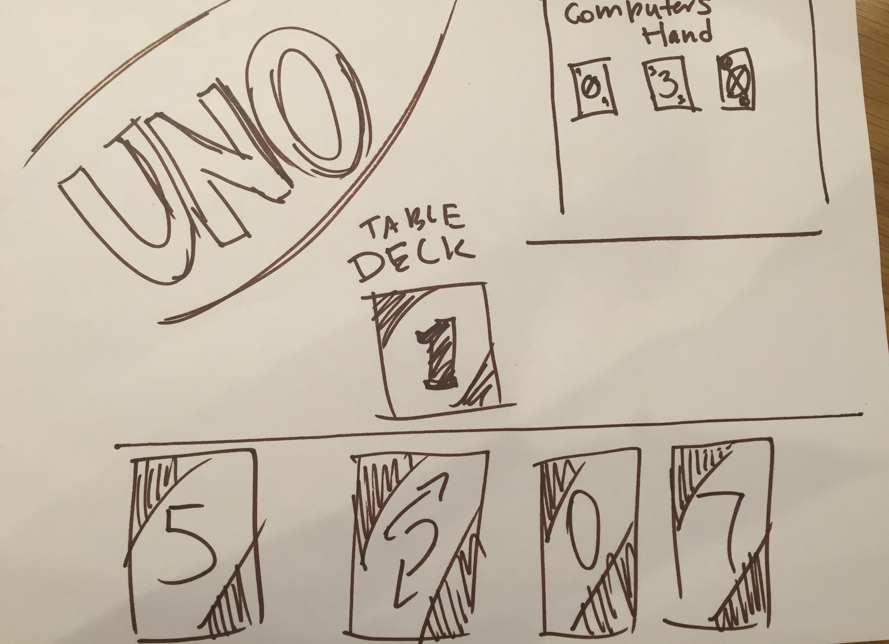

*** Franklin Lema / 7/11/17 ***

# JS-Uno Proposal

## What is JS-Uno?

    Uno is card game that has 108 cards, divided into 25 cards for red, green, blue, and yellow,  zero to nine. Also there is a "Skip", "Draw Two", and "Reverse" cards as well as  four  "Wild" and "Wild Draw Four" cards.

    At start, each player recieves 7 cards. The player to start set down one card. Players sequentially must try to match the color or number value of that card. If an action card is set down (ex. "Skip") players must follow the directions of that card. 
    If the color nor number cannot be matched then players must draw cards until they draw a card that matches color or number. 

    The game is one when a player has no more cards on their hand. 

## Wireframe

## Initial thoughts on game structure

    The code-game will have an array of 108 elements to repesent the Uno card deck. Each element will be an object, which represents an Uno card, which has a color key, number key and a "special action" attribute.

    This game will be played against the computer.

    Two empty arrays will be declared to represent the computer's hand
    (set of cards being played).

    A third empty array will represent the cards on the table. 

    Cards represented by objects will be moved to corresponding arrays using pop() and push() methods.

    Uno Deck(array)-> player hand(array)->cards on table(array);  

## Phases of Completion

    (The steps or phases you expect to go through, and the tasks that you'll need to accomplish to reach each step. These should resemble the acceptance criteria we were working through earlier.)

    - Determine logic/create wireframe/write code
    - During writing code debugging, making improvements
        -do all the cards load properly
        -is the computer following proper game rules. 
        -is there a winner at some point 

## Links and Resources

    (Anything you've looked up so far or are thinking about using.)

    https://en.wikipedia.org/wiki/Uno_(card_game)